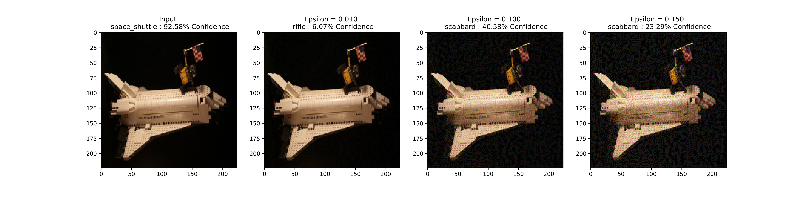

# Deep-Learning-Project

## Context and Goal:

- Adversarial Attacks now is an increasing threat in the AI and machine learning community. And Evasion attacks, which are the most prevalent type of attack, can inserts a small perturbation into the input of a model to make it classify incorrectly.  In addition, it is difficult for developers to improve model in real-time. Therefore, ML researchers are looking for some ways that can make model robust against attacking.

- Inspired by high performance and efficiency that transfer learning model achieved, we are encouraged to apply this method into the mobilenetv2, which is an effective model that pushes the state of the art for mobile visual recognition including classification, object detection and semantic segmentation. We would like to fine tune this model to see whether it can hold the performance under evasion attacks.

## Approach:

- Get base models A and B
    - Base A: MobileNetV2 pre-trained with ImageNet1K
    - Select target dataset that has mutual exclusive images from the pre-trained dataset: [ImageNet-R](https://github.com/hendrycks/imagenet-r), a collection of images labelled with ImageNet-2012 labels and collected from art, cartoons, tattoos and other artistic areas.
    - Load and preprocess the dataset in `ImageFolder` format
    - Train and Evaluate the model (Base B) by feeding ImageNet-R dataset
- Get models by applying the transfer learning and fine tuning
    - Copy the first N blocks’ weights from pretrained MobileNetV2 model
        - For ANB models, the weights are frozen
        - For ANB+ models, the layers are trainable
    - Rest of the layers are initialized with random weights
    - Train the models
        - For ANB models, train for 4 epochs
        - For ANB+ models, train for 2 epochs and fine-tune for 2 epochs
    - Save the models and performance results
- Generate adversarial dataset by applying the FGSM algorithm
    - Calculate the loss of each image using Base A model
    - Apply FGSM to maximize the perturbations
    - Add the perturbations to original test images to create adversarial examples
- Evaluate the performance of models from transfer learning and fine tuning
    - Feed the adversarial test images into each model
    - Save the natural accuracy and adversarial accuracy of each model
    - Compare the performance of transferable models

### Code Structure:

- **Load and Process Dataset**
- **Load Pre-trained Model**
- **Transfer Learning Model**
- **Train Base Model (i.e. 𝐵𝑛𝐵)**
- **Train Transfer Learning Model (i.e. 𝐴𝑛𝐵 and 𝐴𝑛𝐵+)**
- **Plot Transfer Learning Performance**
- **Adversarial Example**
- **Adversarial Example Robustness Visualization**

### Results:

- Choice of $\epsilon$:

- Transfer Learning & Fine Tuning:

- Adversarial Robustness:

### Conclusion:

- Transferability
    - Models that trained on transferable features and allow for fine tuning perform better than the base model. And the performance get improved as transferable features increase.
    - Models that trained on transferable features and do not allow for fine tuning perform worse than the base model. And the performance degrades as transferable features increase.
- Robustness Against Adversarial Examples:
    - Transfer learning and Fine tuning render us more robust models that can hold the model performance when feeding with adversarial examples.
    - The model with all transferable blocks weights and is allowed for fine tuning has the best performance and hold its performance the most when facing adversarial attacks.
    - The models generated by transfer learning but are not allowed with fine-tuning have a degraded performance as more blocks are frozen.